## Squashed Hack The Box walkthrough

Squashed by https://twitter.com/sayli_ambure

Link: https://www.hackthebox.com/machines/squashed

## Solution

#### 1. Sudo nmap -sC -sV -T4 squashed.htb

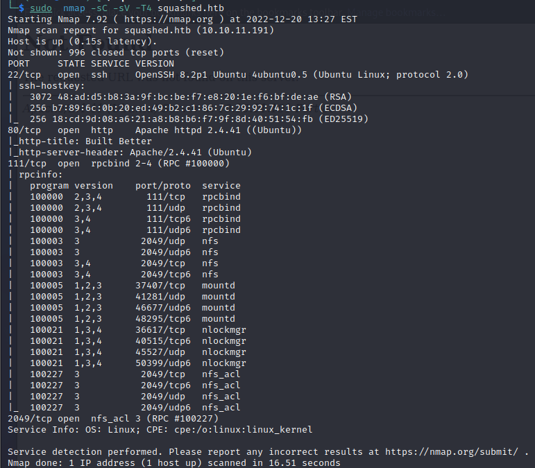

#### 2. showmount -e squashed.htb

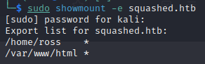

#### 3. check folder owner's userid

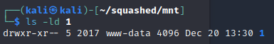

#### 4. Add new user with user id 2017 

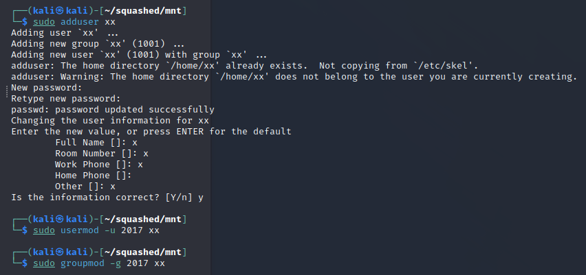

#### 5. Check folder content

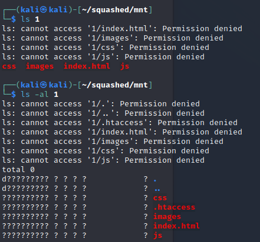

#### 6. Change user to xx and check folder content

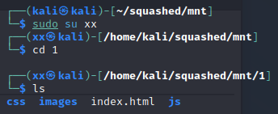

#### 7. Copy reverse shell to folder

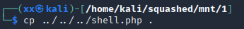

#### 8. Use netcat on 1234 in terminal 2 and open curl http://10.10.11.191/shell.php in terminal 1 

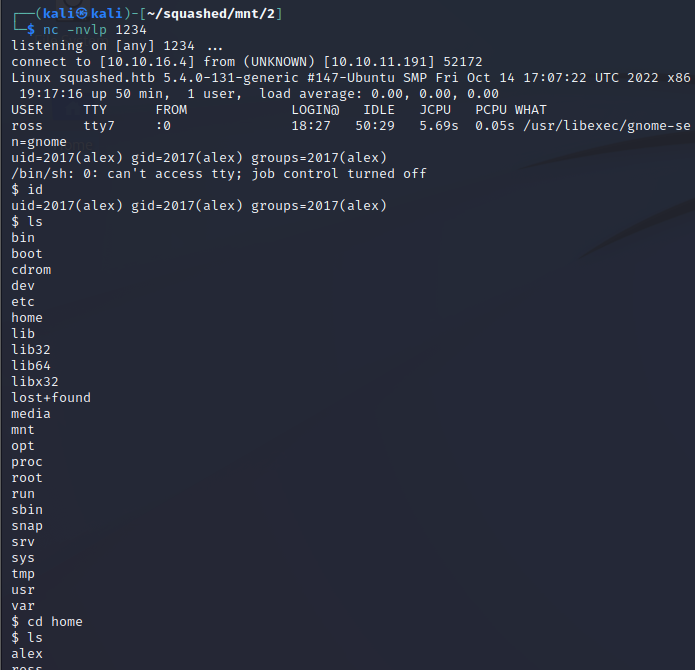

#### 9. user.txt has the user flag

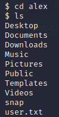

#### 10. Add new user with user id 1001

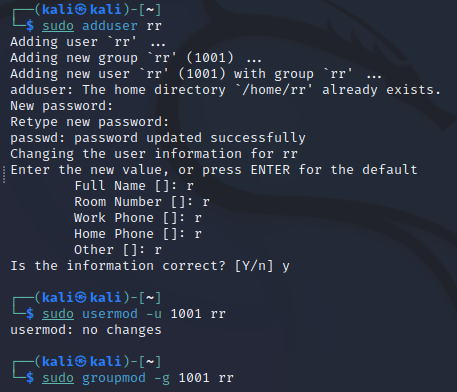

#### 11. Copy .Xauthority's base64 code

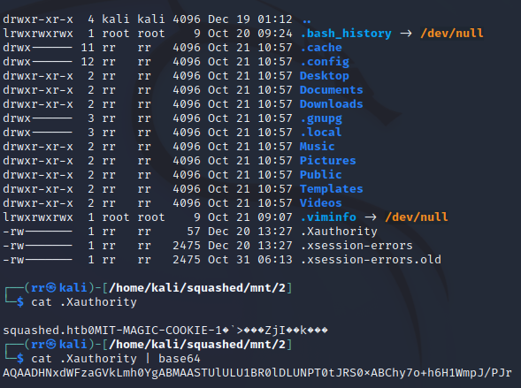

#### 12. Decode it and save it in shell > export > take a screenshot

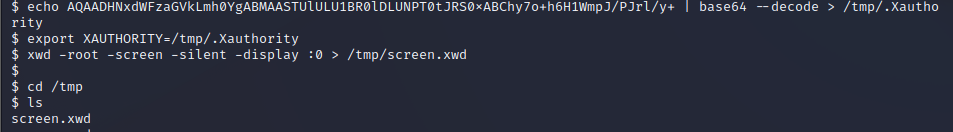

#### 13. Start python server in tmp

#### 14. Download it in our machine and convert to .png

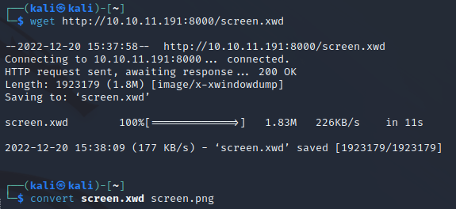

#### 15. Open it and you can see the root password

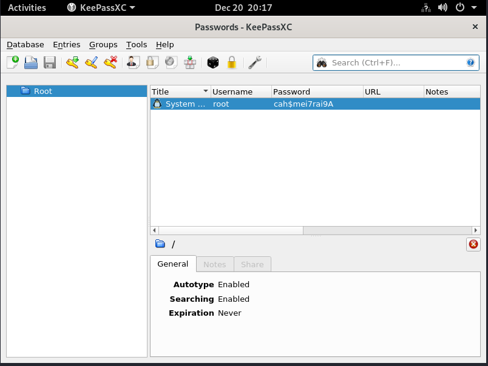

#### 16. Use the password for ssh and the root flag in root.txt

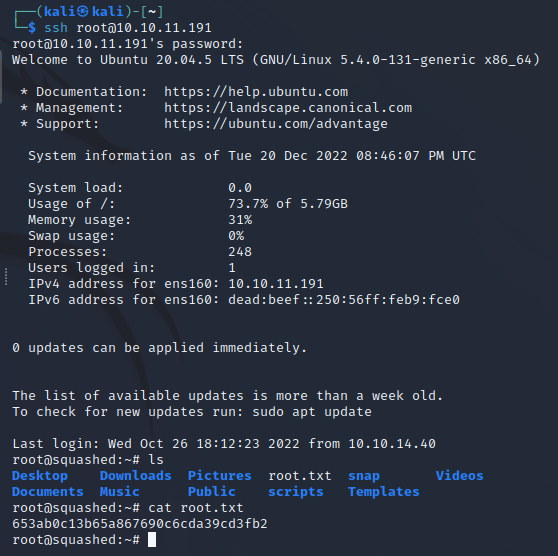
